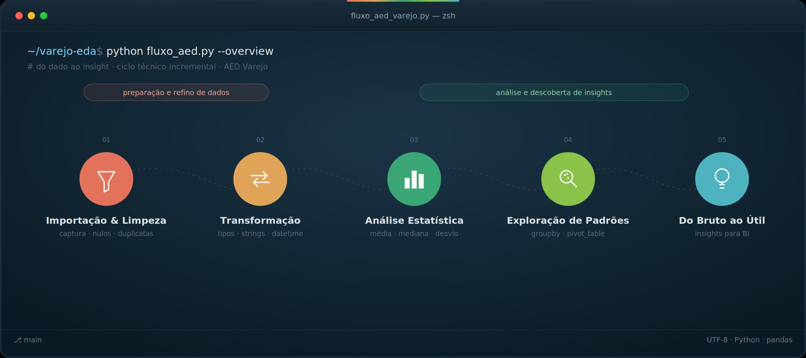

# Mini-Projeto Avaliativo — Análise Exploratória de Dados de Varejo

## Sobre o projeto

Este projeto apresenta uma Análise Exploratória de Dados (AED) aplicada à base de dados **Varejo**, desenvolvida como parte do Mini-Projeto Avaliativo do Módulo 1 — Semana 07 do curso de **Visualização de Dados e Business Intelligence**.

O objetivo é explorar a estrutura e a qualidade dos dados, realizar os tratamentos necessários e utilizar estatística descritiva e agrupamentos para identificar padrões na base.

A análise foi desenvolvida de forma incremental, contemplando as etapas de importação, transformação, limpeza, validação, análise estatística e exploração de padrões.

## Metodologia

O desenvolvimento da AED foi organizado em etapas sucessivas:

1. **Importação e reconhecimento da base** — identificação dos registros, colunas, tipos de dados e estrutura geral.
2. **Transformação e limpeza** — tratamento de valores ausentes, categorias sem informação, duplicidades e tipos de dados.
3. **Validação** — verificação da consistência dos identificadores e das regras de negócio da base.
4. **Estatística descritiva** — análise da variável `CL_FHL`, correspondente ao número de filhos do cliente.
5. **Agrupamentos** — análise de compras distintas por sexo informado e por categoria de produto.
6. **Interpretação** — consolidação dos resultados e identificação dos principais achados da análise.

## ETL e qualidade dos dados

ETL é o processo de **Extração, Transformação e Carga (Extract, Transform, Load)** dos dados. Em um fluxo de análise, essas etapas são fundamentais para que os dados utilizados nas análises estejam estruturados e apresentem qualidade suficiente para produzir resultados confiáveis.

Na etapa de **extração**, os dados da base `Varejo.csv` foram carregados para o ambiente de análise. Na **transformação**, foram investigados e tratados problemas relacionados a valores ausentes, categorias sem informação, duplicidades e tipos de dados. Também foram verificadas regras de negócio relacionadas aos identificadores das compras.

A etapa de **carga**, neste projeto, corresponde à disponibilização dos dados tratados no DataFrame utilizado nas etapas seguintes da análise.

A qualidade dos dados é fundamental porque inconsistências na origem podem comprometer estatísticas, agrupamentos e interpretações. Por isso, a análise não deve começar diretamente pela busca de padrões: primeiro é necessário compreender os dados, verificar sua consistência e realizar os tratamentos adequados.

## Insights da análise

- **Estrutura e qualidade dos dados:** a exploração inicial permitiu identificar a estrutura da base, tratar valores ausentes, categorias sem informação e registros duplicados, além de validar a regra de negócio associada ao identificador da compra.

- **Distribuição do número de filhos:** `CL_FHL` apresentou média de aproximadamente 1,15 filho por cliente, enquanto mediana e moda foram iguais a 0. Os valores variaram de 0 a 4 filhos, evidenciando concentração de clientes sem filhos.

- **Padrões de compras por sexo informado:** `F` apresentou 9.615 compras distintas, enquanto `M` apresentou 8.856, indicando maior volume de compras distintas para `F` na base analisada.

- **Padrões por categoria de produto:** `ALIMENTOS` apresentou o maior número de compras distintas, com 18.267, seguido por `HIGIENE` e `LIMPEZA`.

- **Informação categórica remanescente:** mesmo após o tratamento das categorias sem informação, permaneceu a categoria `Sem Categoria`, com 3.228 compras distintas, indicando a existência de registros cuja categoria original não estava disponível.

## Considerações finais

A análise mostrou que a exploração de dados depende diretamente da compreensão da estrutura e da qualidade da base. O tratamento e a validação dos dados foram etapas necessárias antes da aplicação das estatísticas e dos agrupamentos.

Os resultados obtidos representam apenas algumas das possibilidades de exploração da base. Diferentes combinações entre as variáveis poderiam gerar outras perguntas e perspectivas de análise.

Mais do que os resultados isolados, o projeto permitiu aplicar de forma prática um processo estruturado de exploração de dados: compreender, preparar, medir, comparar e interpretar.
